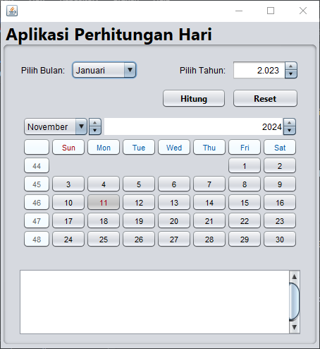
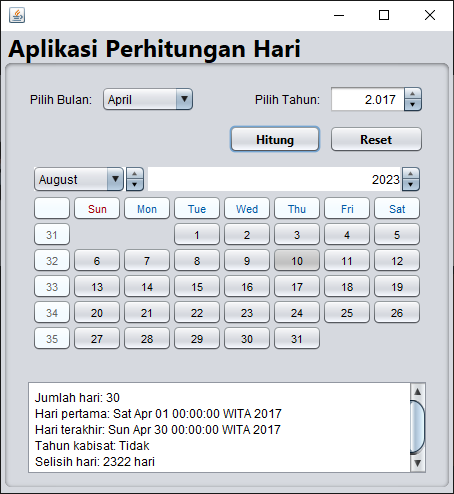

# Day Calculator Application

Aplikasi Day Calculator ini adalah aplikasi berbasis Java Swing yang digunakan untuk melakukan berbagai perhitungan terkait tanggal, hari, dan tahun. Aplikasi ini dapat membantu pengguna untuk mengetahui jumlah hari dalam suatu bulan, informasi hari pertama dan terakhir dalam bulan tersebut, selisih hari antara dua tanggal, serta status tahun kabisat. Fitur reset input juga tersedia untuk memudahkan pengguna mengatur ulang data.

## Fitur Utama

1. **Menghitung Jumlah Hari dalam Bulan Tertentu**
   - Pengguna dapat memilih bulan dan tahun untuk mengetahui jumlah hari dalam bulan yang dipilih.

2. **Menampilkan Hari Pertama dan Terakhir dalam Bulan**
   - Menampilkan hari pertama dan hari terakhir dalam bulan berdasarkan bulan dan tahun yang dipilih.

3. **Menghitung Selisih Hari antara Dua Tanggal**
   - Aplikasi memungkinkan pengguna memilih dua tanggal, kemudian menghitung dan menampilkan selisih hari di antara kedua tanggal tersebut.

4. **Menentukan Tahun Kabisat**
   - Berdasarkan tahun yang dipilih pengguna, aplikasi akan menampilkan apakah tahun tersebut merupakan tahun kabisat atau tidak.

5. **Reset Input**
   - Fitur ini memungkinkan pengguna untuk mengatur ulang semua input ke nilai default, sehingga pengguna dapat memulai perhitungan baru tanpa menghapus input satu per satu.

## Antarmuka Pengguna
- ### tampilan awal program
  
- ### menginputkan bulan dan tahun, lalu menghitung jumlah hari dll, lalu menampilkan outputnya
  

Tampilan aplikasi terdiri dari:
- **JComboBox** untuk memilih bulan.
- **JSpinner** untuk memasukkan tahun.
- **JCalendar** untuk memilih tanggal (input kedua).
- **JButton "Hitung"** untuk memulai proses perhitungan.
- **JButton "Reset"** untuk mengatur ulang input.
- **JLabel** untuk menampilkan hasil perhitungan, seperti jumlah hari, hari pertama dan terakhir, keterangan tahun kabisat, dan selisih hari.

## Cara Penggunaan

1. Pilih bulan dan tahun di bagian input pertama.
2. Pilih tanggal di bagian input kedua menggunakan JCalendar.
3. Klik tombol **Hitung** untuk melihat hasil perhitungan yang mencakup:
   - Jumlah hari dalam bulan.
   - Hari pertama dan hari terakhir dalam bulan tersebut.
   - Status tahun kabisat.
   - Selisih hari antara tanggal yang dipilih di input pertama dan kedua.
4. Gunakan tombol **Reset** jika ingin mengatur ulang semua input dan memulai perhitungan baru.

## Teknologi yang Digunakan

- **Bahasa Pemrograman**: Java
- **Framework GUI**: Java Swing
- **IDE**: NetBeans

## Pengembangan Lebih Lanjut

Untuk pengembangan selanjutnya, beberapa fitur yang dapat ditambahkan meliputi:
- Penghitungan hari kerja dan akhir pekan.
- Menyimpan hasil perhitungan dalam file.
- Menampilkan hari libur nasional berdasarkan bulan dan tahun.
- Dukungan untuk berbagai format tanggal.

## Cara Menjalankan

1. Clone atau download repository ini.
2. Buka proyek di NetBeans.
3. Jalankan proyek menggunakan `F6` atau melalui menu `Run > Run Main Project`.

## Penulis

Aplikasi ini dikembangkan sebagai proyek latihan untuk meningkatkan keterampilan pemrograman dalam Java dan membuat aplikasi GUI dengan Java Swing.

---

Terima kasih telah menggunakan aplikasi Day Calculator ini! Silakan beri masukan jika ada saran atau fitur tambahan yang diinginkan.
